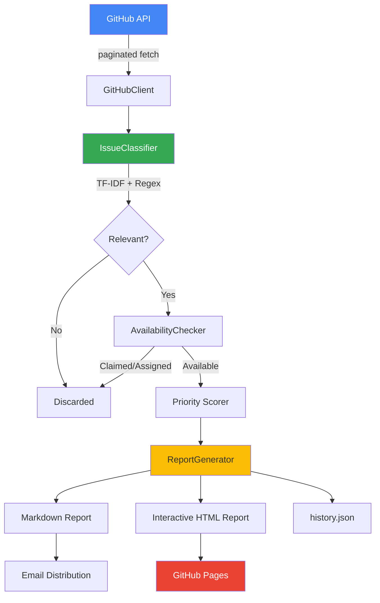

# Terraform Provider Google — Issues Analyzer

[](https://github.com/SCSAndre/terraform-provider-google-issues-analyzer/actions/workflows/ci.yml)
[](https://www.python.org/downloads/)
[](LICENSE)
[](https://docs.astral.sh/ruff/)
[](pyproject.toml)

> **Cloud Armor issue intelligence for `hashicorp/terraform-provider-google`.**
>
> Scans open GitHub issues, classifies Cloud Armor relevance using TF-IDF + regex heuristics, checks whether issues are truly available (not assigned/claimed/in‑progress), and generates Markdown + interactive HTML reports for maintainers and stakeholders.

---

## Table of Contents
[](https://www.python.org/downloads/)
- [Purpose](#purpose)
- [Architecture](#architecture)
- [Project Structure](#project-structure)
- [Quick Start](#quick-start)
- [Configuration Reference](#configuration-reference)
- [Reports & Outputs](#reports--outputs)
- [Testing](#testing)
- [CI/CD Pipelines](#cicd-pipelines)
- [Secret Backends](#secret-backends)
- [Offline Quality Evaluation](#offline-quality-evaluation)
- [Weekly Automation](#weekly-automation)
- [Observability](#observability)
- [Contributing](#contributing)
- [Security](#security)
- [License](#license)

---
[](https://docs.astral.sh/ruff/)
[](pyproject.toml)

> **Cloud Armor issue intelligence for `hashicorp/terraform-provider-google`.**

- **Track** the Cloud Armor issue backlog across the Terraform Provider Google repository.
- **Prioritize** issues with ML‑powered confidence scoring (TF-IDF + regex + shadow scoring).
- **Identify** contributor entry points, quick wins, and attention‑needed items.
- **Generate** weekly HTML/Markdown reports for engineering teams and client stakeholders.
- **Automate** report distribution via email (SMTP) and GitHub Pages deployment.
---
### Current Scope
## Table of Contents
| Attribute        | Value                                         |
|------------------|-----------------------------------------------|
| **Service**      | Cloud Armor                                   |
| **Target Repo** | `hashicorp/terraform-provider-google`         |
| **Output**       | `analysis_results/` (Markdown + HTML reports) |
- [Project Structure](#project-structure)
Service scope is enforced in [`service_definitions.py`](src/terraform_issues_analyzer/service_definitions.py) and is designed to be extensible to additional GCP services via configuration.
- [Configuration Reference](#configuration-reference)
---
- [Testing](#testing)
## Architecture



### Pipeline Stages

| Stage | Module | Description |
|-------|--------|-------------|
| **Fetch** | `github_client.py` | Paginated GitHub API client with rate limiting, retry logic (tenacity), and request caching |
| **Classify** | `issue_classifier.py` | TF-IDF vectorizer + regex scoring with negative gating and optional trigram shadow mode |
| **Availability** | `availability_checker.py` | Checks assignees, labels, comments, and linked PRs via timeline API |
| **Score** | `cli.py` | Multi‑signal priority scoring: confidence, engagement, age, neglect, reactivation, crash severity |
| **Report** | `report_generator.py` | Markdown report with executive summary, entry points, quick wins, and category analysis |
| **HTML** | `html_report_generator.py` | Interactive HTML report with filtering, search, charts, and trend visualization |
| **Distribute** | `send_team_email.py` | SMTP‑based email distribution with HTML report attachment |

---

## Project Structure

```
terraform-provider-google-issues-analyzer/
├── src/
│   └── terraform_issues_analyzer/      # Main package
│       ├── __init__.py                 # Package metadata & public API
│       ├── cli.py                      # Entry point & pipeline orchestrator
│       ├── config.py                   # Centralized configuration (env vars)
│       ├── github_client.py            # GitHub API client (rate limiting, retry)
│       ├── issue_classifier.py         # TF-IDF + regex classification engine
│       ├── availability_checker.py     # Issue availability verification
│       ├── report_generator.py         # Markdown report generation
│       ├── html_report_generator.py    # Interactive HTML report generation
│       ├── report_logic.py             # Shared report business logic (DRY)
│       ├── send_team_email.py          # SMTP email distribution
│       ├── service_definitions.py      # GCP service category definitions
│       ├── types_definitions.py        # TypedDict data contracts
│       ├── exceptions.py              # Domain-specific exception hierarchy
│       ├── logging_config.py          # Structured logging (JSON/console)
│       ├── validators.py              # Input validation utilities
│       ├── secrets_provider.py        # Secrets abstraction (env/GCP)
│       ├── offline_evaluator.py       # Classifier quality evaluation
│       ├── evaluate_classifier_quality.py  # CLI for offline evaluation
│       └── utils.py                   # Shared utility helpers
├── tests/                             # 354 unit tests (83% coverage)
│   ├── test_availability_checker.py
│   ├── test_exceptions.py
│   ├── test_github_client.py
│   ├── test_html_report_generator.py
│   ├── test_issue_classifier.py
│   ├── test_logging_config.py
│   ├── test_offline_evaluator.py
│   ├── test_report_generator.py
│   ├── test_script.py
│   ├── test_secrets_provider.py
│   ├── test_service_definitions.py
│   └── test_validators.py
├── .github/workflows/
│   ├── ci.yml                         # Lint, type-check, test, security scan
│   ├── terraform_report.yml           # Weekly report + email + GitHub Pages
│   └── offline_shadow_quality.yml     # Classifier quality gate
├── docs/                              # Dataset governance & templates
├── pyproject.toml                     # Single source of truth for deps & config
├── requirements.txt                   # Pinned production dependencies
├── requirements-dev.txt               # Dev/test dependencies
└── analysis_results/                  # Generated reports (gitignored)
```

---
- [Observability](#observability)
- [Contributing](#contributing)
- [Security](#security)
### Prerequisites

- Python 3.11+
- A [GitHub Personal Access Token](https://github.com/settings/tokens) (recommended)

### Installation

- [License](#license)
# Clone the repository
git clone https://github.com/SCSAndre/terraform-provider-google-issues-analyzer.git
cd terraform-provider-google-issues-analyzer

# Create virtual environment

source venv/bin/activate  # Linux/macOS
# venv\Scripts\activate   # Windows
- **Generate** weekly HTML/Markdown reports for engineering teams and client stakeholders.
# Install in editable mode with dev dependencies
pip install -e ".[dev]"

| Attribute        | Value                                         |
### Run the Analyzer

```mermaid
flowchart TD
python -m terraform_issues_analyzer.cli
    D -->|Yes| E[AvailabilityChecker]
    D -->|No| F[Discarded]
Reports are generated in `analysis_results/`.

---

## Configuration Reference

All settings are loaded from environment variables with sensible defaults.

### Core Settings

| Variable | Default | Description |
|----------|---------|-------------|
| `GITHUB_TOKEN` | *(none)* | GitHub PAT. Without: 60 req/hr. With: 5,000 req/hr |
| `TARGET_REPO` | `hashicorp/terraform-provider-google` | Repository to analyze |
| `MIN_CONFIDENCE_THRESHOLD` | `75` | Minimum confidence score (0–100) |
| `OUTPUT_DIR` | `analysis_results` | Directory for generated reports |
| `LOG_LEVEL` | `INFO` | Logging level (`DEBUG`, `INFO`, `WARNING`, `ERROR`) |
| `LOG_FORMAT` | `console` | Log format: `console` or `json` |

### NLP Shadow Mode (Experimental)

| Variable | Default | Description |
|----------|---------|-------------|
| `ENABLE_TRIGRAM_SHADOW_MODE` | `false` | Compare baseline vs tri-gram TF-IDF (logs only) |
| `SHADOW_SCORE_DELTA_THRESHOLD` | `15.0` | Alert threshold for score delta |

### Email Distribution

| Variable | Default | Description |
|----------|---------|-------------|
| `SMTP_SERVER` | `smtp.gmail.com` | SMTP server hostname |
| `SMTP_PORT` | `587` | SMTP port (587=TLS, 465=SSL) |
| `SMTP_USERNAME` | *(none)* | SMTP authentication username |
| `SMTP_PASSWORD` | *(none)* | SMTP password or app password |
| `EMAIL_FROM` | *(SMTP_USERNAME)* | Sender email address |
| `TEAM_EMAILS` | *(none)* | Comma-separated recipient list |

### GCP Secret Manager (Optional)

| Variable | Default | Description |
|----------|---------|-------------|
| `SECRET_BACKEND` | `env` | Secret backend: `env` or `gcp` |
| `GCP_PROJECT_ID` | *(none)* | GCP project for Secret Manager |
| `GCP_SECRET_PREFIX` | *(none)* | Secret name prefix (e.g., `terraform-issues-analyzer-`) |
| `SECRET_FALLBACK_TO_ENV` | `true` | Fall back to env vars when GCP unavailable |

See [`.env.example`](.env.example) for a complete template.

---

## Reports & Outputs

The analyzer generates two report formats:

### Markdown Report
- Executive summary with key metrics
- Contributor entry points (safe, scoped issues)
- Quick wins (small size, has PR, good first issue)
- Attention needed (stale + high engagement)
- Recently reactivated issues
- Category and label distribution analysis

### Interactive HTML Report
- Client-side filtering and search
- Sortable issue tables
- Confidence distribution charts
- Historical trend visualization (from `history.json`)
- Dark mode support

---

## Testing

```bash
# Run all 354 tests with coverage
python -m pytest

# Run specific test module
python -m pytest tests/test_issue_classifier.py -v

# Run with minimal output
python -m pytest -q
```

### Test Coverage

Coverage target: **80%** (current: **83%**). Enforced in CI via `pytest-cov`.

---

## CI/CD Pipelines

### CI Pipeline (`.github/workflows/ci.yml`)

Triggered on every push and PR:

| Job | Tool | Purpose |
|-----|------|---------|
| **Lint** | Ruff | Code style, import sorting, security rules |
| **Type Check** | MyPy | Static type analysis |
| **Test** | Pytest | Unit tests with ≥80% coverage gate |
| **Security** | Bandit | SAST security scanning |
| **Build** | Setuptools | Package build + import verification |

### Report Pipeline (`.github/workflows/terraform_report.yml`)

Weekly (Monday 10:00 AM PT) + manual dispatch:

1. Runs the full analysis pipeline
2. Deploys HTML report to GitHub Pages
3. Sends email digest to team (optional)
4. Uploads reports as build artifacts

### Quality Gate (`.github/workflows/offline_shadow_quality.yml`)

Evaluates classifier accuracy against labeled dataset:

- **PR trigger**: Informational run with artifact output
- **Weekly schedule**: Quality gate with regression thresholds
- **Manual**: Supports custom dataset, split, and tolerance parameters

#### Smoke Runs
    E -->|Claimed/Assigned| F
    G --> H[ReportGenerator]
# Trigger workflows manually
gh workflow run "Terraform Issues Report" -f dry_run=true -f send_email=false
gh workflow run "CI Pipeline"
gh workflow run "Offline Shadow Quality" -f enforce_gate=false
    style A fill:#4285F4,color:#fff
    style C fill:#34A853,color:#fff
---

## Secret Backends
    style L fill:#EA4335,color:#fff
### Environment Variables (Default)

Secrets are read directly from environment variables. Suitable for local development and CI.

### GCP Secret Manager (Optional)

For production deployments:

| Stage | Module | Description |
|-------|--------|-------------|
| **Fetch** | `github_client.py` | Paginated GitHub API client with rate limiting, retry logic (tenacity), and request caching |
| **Classify** | `issue_classifier.py` | TF-IDF vectorizer + regex scoring with negative gating and optional trigram shadow mode |
export SECRET_FALLBACK_TO_ENV="true"  # Keep during migration
| **Score** | `cli.py` | Multi‑signal priority scoring: confidence, engagement, age, neglect, reactivation, crash severity |
| **Report** | `report_generator.py` | Markdown report with executive summary, entry points, quick wins, and category analysis |
**Expected secret names in GCP Secret Manager:**
---

## Project Structure

```
terraform-provider-google-issues-analyzer/
> **Tip:** Keep `SECRET_FALLBACK_TO_ENV=true` during onboarding, then switch to `false` after validation.

---
│       ├── cli.py                      # Entry point & pipeline orchestrator
## Offline Quality Evaluation
│       ├── github_client.py            # GitHub API client (rate limiting, retry)
Compare baseline vs shadow classifier scoring against a labeled dataset.
│       ├── availability_checker.py     # Issue availability verification
### Labeled CSV Schema

| Column | Required | Format |
|--------|----------|--------|
| `title` | ✅ | Issue title text |
| `body` | ✅ | Issue body text |
| `is_relevant` | ✅ | `true`/`false`, `1`/`0`, `yes`/`no` |
| `labels` | ❌ | Pipe/comma/semicolon-delimited |
| `category` | ❌ | e.g., `Cloud Armor` |
| `split` | ❌ | `train`, `validation`, or `test` |

### Run Evaluation
│       ├── html_report_generator.py    # Interactive HTML report generation
│       ├── report_logic.py             # Shared report business logic (DRY)
python -m terraform_issues_analyzer.evaluate_classifier_quality \
  --input path/to/labeled_issues.csv
│   ├── test_report_generator.py
# With quality gate
python -m terraform_issues_analyzer.evaluate_classifier_quality \
Reports are generated in `analysis_results/`.

---

  --max-f1-drop 0.02
### Core Settings

See [`docs/dataset_governance.txt`](docs/dataset_governance.txt) and [`docs/labeled_issues_template.txt`](docs/labeled_issues_template.txt) for governance guidance and labeling templates.
| `TARGET_REPO` | `hashicorp/terraform-provider-google` | Repository to analyze |
---
| `OUTPUT_DIR` | `analysis_results` | Directory for generated reports |
## Weekly Automation
| `LOG_FORMAT` | `console` | Log format: `console` or `json` |
### GitHub Actions (Recommended)
### NLP Shadow Mode (Experimental)
The repository includes `.github/workflows/terraform_report.yml` which runs every Monday at 10:00 AM PT.
| `SHADOW_SCORE_DELTA_THRESHOLD` | `15.0` | Alert threshold for score delta |
> **Note:** GitHub Actions cron uses UTC. DST transitions may shift the schedule by ±1 hour.

### Local Cron (Alternative)
### Email Distribution

crontab -e
# Add:
0 10 * * 1 /path/to/scheduled_report.sh
| `SMTP_SERVER` | `smtp.gmail.com` | SMTP server hostname |
| `SMTP_PORT` | `587` | SMTP port (587=TLS, 465=SSL) |
---
| `SECRET_BACKEND` | `env` | Secret backend: `env` or `gcp` |
## Observability
See [`.env.example`](.env.example) for a complete template.
- **Structured logging:** Set `LOG_FORMAT=json` for machine-parseable logs in CI/production.
- **Debug mode:** Set `LOG_LEVEL=DEBUG` for verbose output during incident analysis.
- **Correlation IDs:** Every request chain gets a unique correlation ID for tracing.
- **Startup summary:** Non-sensitive config summary logged at startup (e.g., whether `GCP_PROJECT_ID` is set).
---
---
### Test Coverage

Coverage target: **80%** (current: **83%**). Enforced in CI via `pytest-cov`.

# Install dev dependencies
pip install -e ".[dev]"

# Run linter
ruff check src/ tests/

# Run formatter
ruff format src/ tests/

# Run type checker
mypy src/terraform_issues_analyzer/

# Run tests
python -m pytest -v
## CI/CD Pipelines

### Workflow

1. Fork the repository
2. Create a feature branch (`git checkout -b feature/my-feature`)
3. Make changes with tests
4. Ensure all quality gates pass:
   - `ruff check` — no lint errors
   - `ruff format --check` — consistent formatting
   - `mypy` — no type errors
   - `pytest` — all tests pass with ≥80% coverage
5. Open a PR with proposed design and rollout/rollback plan

---

## Security

- **Secrets:** Prefer CI secret stores or cloud secret managers over local `.env` files.
- **Tokens:** Always use a GitHub token to avoid the 60 req/hr unauthenticated limit.
- **Reports:** Avoid committing generated reports if they contain sensitive operational metadata.
- **Dependencies:** Scanned via Bandit (SAST) in every CI run.

---

## License

This project is licensed under the MIT License. See the [LICENSE](LICENSE) file for details.

Triggered on every push and PR:

| Job | Tool | Purpose |
|-----|------|---------|
| **Lint** | Ruff | Code style, import sorting, security rules |
| **Type Check** | MyPy | Static type analysis |
| **Test** | Pytest | Unit tests with ≥80% coverage gate |
| **Security** | Bandit | SAST security scanning |
| **Build** | Setuptools | Package build + import verification |

### Report Pipeline (`.github/workflows/terraform_report.yml`)

Weekly (Monday 10:00 AM PT) + manual dispatch:

1. Runs the full analysis pipeline
2. Deploys HTML report to GitHub Pages
3. Sends email digest to team (optional)
4. Uploads reports as build artifacts

### Quality Gate (`.github/workflows/offline_shadow_quality.yml`)

Evaluates classifier accuracy against labeled dataset:

- **PR trigger**: Informational run with artifact output
- **Weekly schedule**: Quality gate with regression thresholds
- **Manual**: Supports custom dataset, split, and tolerance parameters

#### Smoke Runs

```bash
# Trigger workflows manually
gh workflow run "Terraform Issues Report" -f dry_run=true -f send_email=false
gh workflow run "CI Pipeline"
gh workflow run "Offline Shadow Quality" -f enforce_gate=false
```

---

## Secret Backends

### Environment Variables (Default)

Secrets are read directly from environment variables. Suitable for local development and CI.

### GCP Secret Manager (Optional)

For production deployments:

```bash
export SECRET_BACKEND="gcp"
export GCP_PROJECT_ID="your-gcp-project-id"
export GCP_SECRET_PREFIX="terraform-issues-analyzer-"
export SECRET_FALLBACK_TO_ENV="true"  # Keep during migration
```

**Expected secret names in GCP Secret Manager:**

- `terraform-issues-analyzer-GITHUB_TOKEN`
- `terraform-issues-analyzer-SMTP_USERNAME`
- `terraform-issues-analyzer-SMTP_PASSWORD`
- `terraform-issues-analyzer-TEAM_EMAILS`

> **Tip:** Keep `SECRET_FALLBACK_TO_ENV=true` during onboarding, then switch to `false` after validation.

---

## Offline Quality Evaluation

Compare baseline vs shadow classifier scoring against a labeled dataset.

### Labeled CSV Schema

| Column | Required | Format |
|--------|----------|--------|
| `title` | ✅ | Issue title text |
| `body` | ✅ | Issue body text |
| `is_relevant` | ✅ | `true`/`false`, `1`/`0`, `yes`/`no` |
| `labels` | ❌ | Pipe/comma/semicolon-delimited |
| `category` | ❌ | e.g., `Cloud Armor` |
| `split` | ❌ | `train`, `validation`, or `test` |

### Run Evaluation

```bash
python -m terraform_issues_analyzer.evaluate_classifier_quality \
  --input path/to/labeled_issues.csv

# With quality gate
python -m terraform_issues_analyzer.evaluate_classifier_quality \
  --input path/to/labeled_issues.csv \
  --fail-on-shadow-regression \
  --max-precision-drop 0.02 \
  --max-recall-drop 0.02 \
  --max-f1-drop 0.02
```

See [`docs/dataset_governance.txt`](docs/dataset_governance.txt) and [`docs/labeled_issues_template.txt`](docs/labeled_issues_template.txt) for governance guidance and labeling templates.

---

## Weekly Automation

### GitHub Actions (Recommended)

The repository includes `.github/workflows/terraform_report.yml` which runs every Monday at 10:00 AM PT.

> **Note:** GitHub Actions cron uses UTC. DST transitions may shift the schedule by ±1 hour.

### Local Cron (Alternative)

```bash
crontab -e
# Add:
0 10 * * 1 /path/to/scheduled_report.sh
```

---

## Observability

- **Structured logging:** Set `LOG_FORMAT=json` for machine-parseable logs in CI/production.
- **Debug mode:** Set `LOG_LEVEL=DEBUG` for verbose output during incident analysis.
- **Correlation IDs:** Every request chain gets a unique correlation ID for tracing.
- **Startup summary:** Non-sensitive config summary logged at startup (e.g., whether `GCP_PROJECT_ID` is set).

---

## Contributing

```bash
# Install dev dependencies
pip install -e ".[dev]"

# Run linter
ruff check src/ tests/

# Run formatter
ruff format src/ tests/

# Run type checker
mypy src/terraform_issues_analyzer/

# Run tests
python -m pytest -v
```

### Workflow

1. Fork the repository
2. Create a feature branch (`git checkout -b feature/my-feature`)
3. Make changes with tests
4. Ensure all quality gates pass:
   - `ruff check` — no lint errors
   - `ruff format --check` — consistent formatting
   - `mypy` — no type errors
   - `pytest` — all tests pass with ≥80% coverage
5. Open a PR with proposed design and rollout/rollback plan

---

## Security

- **Secrets:** Prefer CI secret stores or cloud secret managers over local `.env` files.
- **Tokens:** Always use a GitHub token to avoid the 60 req/hr unauthenticated limit.
- **Reports:** Avoid committing generated reports if they contain sensitive operational metadata.
- **Dependencies:** Scanned via Bandit (SAST) in every CI run.

---

## License

This project is licensed under the MIT License. See the [LICENSE](LICENSE) file for details.
